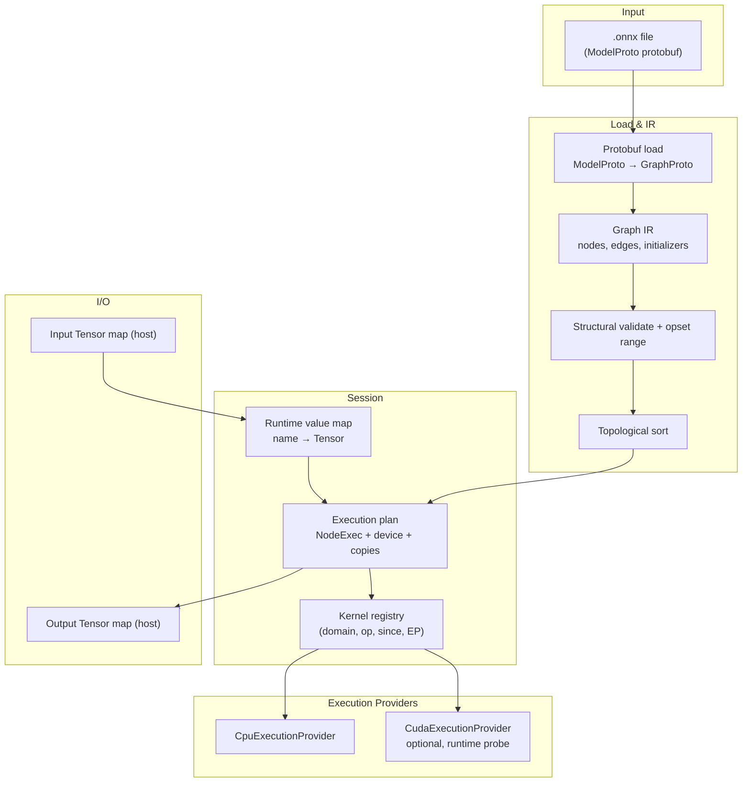
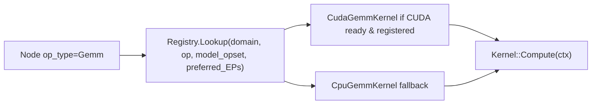
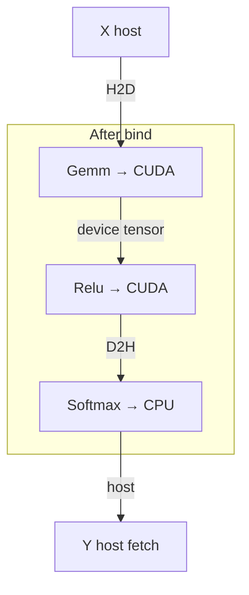
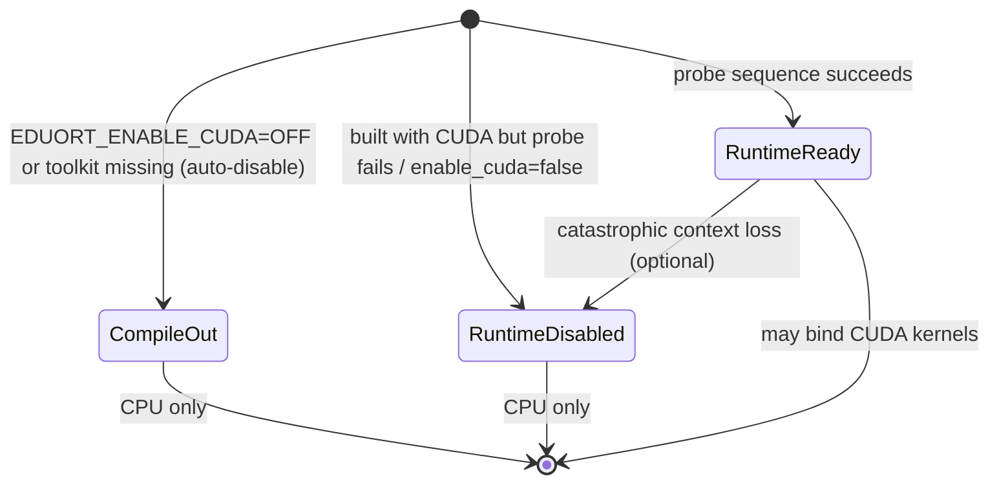

# Educational ONNX Runtime in C++ — Design Document

| Field | Value |
|-------|-------|
| **Title** | Educational ONNX Runtime (`edu-onnx-rt`) |
| **Author** | randomtiwary (design drafted with Grok assistance) |
| **Date** | 2026-07-18 |
| **Status** | Accepted (design review complete; PR1 in progress) |
| **Proposed path** | `/home/personal/work/edu-onnx-runtime` |
| **Proposed GitHub** | `https://github.com/randomtiwary/edu-onnx-runtime` |
| **Audience** | Learners of ML systems / compilers / runtime design (including the author) |
| **cmake_minimum_required** | **3.24** (author machine has CMake 4.3.1; 3.24+ for solid CUDA language + FetchContent UX) |

---

## Overview

This document designs a **from-scratch, educational ONNX inference runtime** written in modern C++. The runtime will load ONNX models (`.onnx` files), build an internal computational graph, and execute a carefully chosen subset of operators on **CPU** first, then optionally on **CUDA GPU**, with graceful fallback when the GPU is missing or flaky.

Unlike Microsoft’s production [ONNX Runtime](https://onnxruntime.ai/), this project prioritizes **clarity, pedagogy, and correct architecture** over peak performance or full operator coverage. Every major concept—protobuf IR, topological execution, kernel registries, execution providers, tensor memory—will be explained in code comments and progressive docs so a reader without a deep ML or compiler background can follow along.

The deliverable is a small CMake/Ninja C++ project with a clean public API (`Env`, `Session`, `Tensor`), unit tests with golden references, a milestone-mapped PR plan of **small reviewable PRs** (~15 after review-driven splits), and docs that grow with the code under enforceable pedagogy gates.

---

## Background & Motivation

### What is ONNX?

**ONNX** (Open Neural Network Exchange) is an open format for representing machine learning models as **computational graphs**. A model is a directed graph of **nodes** (operators such as `MatMul`, `Relu`, `Add`) connected by **tensors** (named multi-dimensional arrays). Training frameworks (PyTorch, TensorFlow, scikit-learn via skl2onnx, etc.) can export models to `.onnx`; any compliant runtime can then run them for inference.

The wire format is **Protocol Buffers** (protobuf). The root message is `ModelProto`, which contains:

- `ir_version` — ONNX Intermediate Representation version
- `opset_import` — which operator set version(s) the model uses (e.g. `ai.onnx` opset 13)
- `graph` — a `GraphProto` with:
  - `node[]` — `NodeProto` list (each has `op_type`, `input[]`, `output[]`, `attribute[]`)
  - `initializer[]` — constant tensors (weights/biases) as `TensorProto`
  - `input[]` / `output[]` — graph I/O as `ValueInfoProto` (name + type + shape)
  - `value_info[]` — optional intermediate tensor type/shape annotations

**References (read these as you implement):**

- [ONNX IR.md](https://github.com/onnx/onnx/blob/main/docs/IR.md) — Intermediate Representation
- [ONNX Operators.md](https://github.com/onnx/onnx/blob/main/docs/Operators.md) — operator specs (inputs, attrs, type constraints)
- [onnx.proto](https://github.com/onnx/onnx/blob/main/onnx/onnx.proto) — protobuf schema
- [ONNX Runtime architecture overview](https://onnxruntime.ai/docs/reference/high-level-design.html) — production mental model (we mirror simplified pieces)

### Why build one?

Reading ONNX Runtime’s production code is hard: it is huge, highly optimized, and assumes familiarity with EP abstractions, MLAS, ORTModule, etc. Building a **tiny** runtime that still has the same *shape* of components teaches:

1. How graphs become executable plans  
2. How kernels are looked up and dispatched  
3. How CPU vs GPU backends plug in without rewriting the session  
4. How tensor layout, shapes, and memory ownership work  

**Build vs study-only:** Reading a minimal interpreter (or ORT snippets) is valuable homework, but **writing** the loader → IR → topo → registry → EP → kernels path is the learning goal. We do not fork ORT or another runtime; we reimplement a tiny subset with intentional simplicity (see Alternatives A8).

### Current state

Greenfield. No existing code in the workspace for this project. Hardware context on the author’s machine:

| Resource | Detail |
|----------|--------|
| CPU | Intel Core i9-11900H (8C/16T), AVX2 + AVX-512 (including VNNI) |
| GPU | NVIDIA GeForce RTX 3050 Mobile (GA107), `/dev/nvidia0`, driver package nvidia-driver-580, **CUDA toolkit 11.5** (`nvcc`) |
| Risk | `nvidia-smi` intermittently reports “No devices were found” → **must** handle GPU probe failure and fall back to CPU |
| iGPU | Intel UHD (Tiger Lake) — **out of scope** |
| Toolchain | g++ 12.3, clang 14, **CMake 4.3.1** on author machine (project requires **≥ 3.24**), Ninja 1.10.1, Linux Ubuntu 22.04 |

**Environment report (before PR3 / PR10):** run and paste into `docs/02-building.md` via `scripts/env_report.sh` (and optional `scripts/check_cuda.py`): `g++ --version`, `cmake --version`, `protoc --version`, `nvcc -V`, `nvidia-smi`, `ls /dev/nvidia*`. Treat intermittent `nvidia-smi` failure as expected, not as a hard CI dependency.

### Pain points we accept by design

- We will **not** support the full ONNX opset (hundreds of ops).  
- We will **not** implement full shape inference for every edge case.  
- We will **not** compete on latency with ORT/TensorRT.  
- GPU support is **optional** and may be unavailable at build *or* runtime.

### Performance & scale envelope

This is an educational runtime. Documented operating envelope (not SLOs):

| Dimension | Target envelope |
|-----------|-----------------|
| Model size | Weights ≤ a few MB; `.onnx` file ≤ **64 MiB** default parse cap |
| Batch | Small, e.g. `N ≤ 32` in fixtures |
| MatMul dims | Interactive 2-D sizes ≤ ~**4096** on a side (naive O(n³) loops) |
| Concurrent sessions | Unsupported as a performance feature; see threading policy |
| Latency / QPS | **No claims**; CLI may print wall time for curiosity only |

Bottlenecks we deliberately accept: triple-loop MatMul, per-tensor allocation, and H2D/D2H at every EP boundary under the mixed-device policy (K13).

---

## Goals & Non-Goals

### Goals

1. **Pedagogy first**: readable C++17, heavy comments citing ONNX specs, progressive `docs/` tutorials aligned with milestones, with **review-enforceable pedagogy gates** (see [Pedagogy acceptance](#pedagogy-acceptance)).  
2. **Correctness** on a fixed, documented operator subset sufficient to run a tiny MLP / logistic-regression-style model (and simple hand-built graphs).  
3. **Architecture that mirrors real runtimes**: Model load → IR → topological order → Session → EP kernel dispatch → Tensor buffers.  
4. **CPU path complete before GPU**: naive scalar kernels first; optional SIMD and CUDA as later milestones.  
5. **Graceful CUDA absence**: build without CUDA; at runtime, if device enumeration/context init fails, log clearly and use CPU.  
6. **Incremental, always-green tree**: each PR builds and (where applicable) passes tests (definition below).  
7. **Testable without GPU**: all core correctness tests run on CPU; GPU tests are gated and skip cleanly.  
8. **Publishable repo** under `randomtiwary` with clear LICENSE, README, and contribution-style PR history for self-review.

### Non-Goals

- Full ONNX opset / versioning matrix compatibility with production ORT.  
- Training, autodiff, or quantized INT8 pipelines (may be future stretch).  
- Dynamic control-flow ops (`If`, `Loop`, `Scan`) in v1.  
- Multi-GPU, multi-stream, or graph-level CUDA fusion.  
- Mobile/edge backends (DirectML, CoreML, OpenVINO, Vulkan).  
- Python bindings (may be a later stretch goal; v1 is C++ API + CLI).  
- Competing with numpy/ORT on performance; SIMD is educational, not mandatory for “done.”  
- Supporting every TensorProto data type (focus on `float32`; limited `int64` for shapes/indices).  
- **Install packaging / `find_package(eduort)`** deferred until after v0.1 (static lib + in-tree consumers/tests only).  
- **Concurrent `Session::Run`**, multi-threaded intra-op parallelism, or a thread pool in v1.  
- Silently re-running a failed CUDA graph on CPU mid-`Run`.

### Definition of “green” (always-green tree)

A PR is mergeable when:

1. `cmake -G Ninja -B build ...` **configure succeeds**  
2. `cmake --build build` **succeeds**  
3. `ctest --test-dir build --output-on-failure` — **all enabled tests pass**  
4. **CUDA is not required** unless the developer explicitly configures `-DEDUORT_ENABLE_CUDA=ON` **and** a device is present; CI always uses `-DEDUORT_ENABLE_CUDA=OFF`  
5. Fixture models required by enabled tests are present (committed or generated in the test setup for that PR)

---

## Key Decisions

| # | Decision | Rationale |
|---|----------|-----------|
| K1 | **Language: C++17** (CMake option to try C++20 later) | Widest compiler comfort on Ubuntu 22.04; structured bindings, `std::optional`, `std::string_view` are enough. Avoid C++20 ranges complexity for learners. |
| K2 | **Repo name: `edu-onnx-runtime`**, path `/home/personal/work/edu-onnx-runtime` | Clear educational intent; searchable; not confused with Microsoft `onnxruntime`. |
| K3 | **Official full `onnx.proto` generation**; pin **onnx v1.14.1** + prefer **system protobuf ≥ 3.21** (FetchContent protobuf **3.21.12** only if system missing); **never hand-trim** `.proto` | “Subset” means subset of *messages we interpret*, not a forked schema. Full official schema stays correct; see [Protobuf acquisition](#protobuf-acquisition-and-version-matrix). |
| K4 | **Operator subset v1 (MVP):** `Constant`, `Identity`, `Add`, `Mul`, `MatMul`, `Gemm`, `Relu`, `Sigmoid`, `Softmax`, `Reshape`, `Flatten` | Enough for logistic regression (`Gemm`/`MatMul`+bias + `Sigmoid`) and a 1–2 layer MLP (`Gemm`→`Relu`→`Gemm`→`Softmax`). **Sigmoid is in MVP** (resolved). |
| K5 | **Two execution providers:** `CpuExecutionProvider` (always), `CudaExecutionProvider` (optional CMake + runtime probe) | Teaches the EP pattern used by real ORT without a zoo of backends. |
| K6 | **Naive kernels first; SIMD and CUDA later** | Correctness and understanding before vectorization; avoids premature optimization in early PRs. MatMul is triple-loop, not Eigen/BLAS (A6). |
| K7 | **No full shape inference engine initially** | Use explicit shapes from the model (`ValueInfo` / initializers) + per-op `InferOutputShape` helpers for our subset. Unsupported dynamic-rank models fail with clear errors. |
| K8 | **Testing: GoogleTest + golden fixtures** as committed **`.f32` raw dumps + JSON shape sidecars** (generated by numpy scripts; optional ORT cross-check in Python only) | No `.npz` in the C++ path; goldens unambiguous without GPU. |
| K9 | **Library name `eduort`**, namespace `eduort::` | Short, distinct from `Ort::` (Microsoft C++ API). |
| K10 | **License: Apache-2.0** for our code; respect ONNX (Apache-2.0) and third-party licenses in `THIRD_PARTY_NOTICES` | Matches ONNX/ORT ecosystem norms. |
| K11 | **Many small PRs** mapped to milestones (including splits of protobuf load and Session/CLI) | Learner-friendly review; each PR leaves tree green. |
| K12 | **Float32 N-D row-major tensors as primary layout** | Matches common ONNX defaults for our ops; document strides explicitly. |
| K13 | **Mixed-device policy (Option A):** per-node EP; Session inserts **H2D before CUDA kernels** and **D2H before CPU kernels** (or whenever consumer device ≠ producer device); **graph outputs always on CPU**; sync before host use | Simplest teachable heterogeneous story; allows CUDA Gemm + CPU Softmax MLP without requiring full CUDA op coverage. Log copy edges at VERBOSE. |
| K14 | **Opset policy:** domain `""` / `ai.onnx` only (**canonicalize both to `""`**); accept model opset **[11, 17]**; kernels register `since_version`; lookup = highest `since_version ≤ model_opset`; fail outside range | Covers Softmax-11 / Gemm-11 semantics; avoids false misses from domain spelling. |
| K15 | **Fixtures are hand-built** with `onnx.helper` (or equivalent) using **only MVP ops**; `scripts/check_model_ops.py` gates CI/fixtures; **do not** use `torch.onnx.export` for primary goldens | Exporters insert Transpose/Cast/Squeeze and block E2E for the wrong reason. |
| K16 | **Public API is `Status` / `StatusOr` only** for recoverable errors; no throwing public constructors for Session | One error style for every PR; pedagogy-friendly explicit paths. |
| K17 | **`Session::Run` is single-threaded and non-reentrant** on a given Session; no concurrent Runs; no parallel node execution in v1 | Avoids TSan surprises; parallelism is a future lesson. |
| K18 | **CMake: static library default**, imported alias **`eduort::eduort`**; no `install()` until post-v0.1 | Enough for in-tree tests/tools; packaging is non-goal for v1. |
| K19 | **CLI ships in PR9b**, shortly after library E2E (PR9a = **v0.1.0**); not an open product question anymore | Library correctness first; CLI is a thin demo layer. |
| K20 | **`Constant` is folded at Create before kernel bind; no Constant IKernel** | Avoids bind failures / dead kernels; still an allowlisted graph op for fixtures. |

**Still open for the user (product only):** repo visibility (public vs private), final repo name preference if not `edu-onnx-runtime`, whether to enable GitHub Actions on a private repo, optional C++20 experiment later, whether optional SIMD PR13 is desired after v0.2.

---

## Proposed Design

### High-level architecture



### End-to-end data flow (inference)

```mermaid
sequenceDiagram
  participant App
  participant Env
  participant Session
  participant Values as ValueMap
  participant Plan as NodeExec
  participant Kernel

  App->>Env: Create Env (logging)
  App->>Session: Session::Create(env, path, opts)
  Session->>Session: Load ModelProto, Graph IR, topo, bind kernels+devices
  App->>Session: Run(feeds, output_names)
  Session->>Values: Seed initializers; overlay feeds
  loop each NodeExec in topo order
    Session->>Session: Ensure inputs on required device (H2D/D2H if needed)
    Session->>Kernel: Compute(ctx)
    Kernel-->>Values: Write outputs (device of this EP)
  end
  Session->>Session: Materialize graph outputs on CPU → fetches
  Session-->>App: Status + host Tensors in fetches
```

### Core components

| Component | Responsibility | Primary headers (proposed) |
|-----------|----------------|----------------------------|
| **Env** | Global logging level, one-time init (no thread pool in v1) | `include/eduort/env.h` |
| **Status / StatusOr** | Recoverable error handling | `include/eduort/status.h` |
| **Tensor / TensorShape / DataType** | Contiguous buffer + shape + dtype + device | `include/eduort/tensor.h` |
| **Model / Graph / Node** | In-memory IR after protobuf parse | `include/eduort/graph.h` |
| **Session / SessionOptions** | Load model, bind EPs, allocate, Run | `include/eduort/session.h` |
| **Kernel / OpKernelContext** | Per-op compute | `include/eduort/kernel.h` |
| **KernelRegistry** | Map `(domain, op_type, since_version, EP)` → factory | `include/eduort/registry.h` |
| **ExecutionProvider** | Name, allocator, capability, CreateKernel | `include/eduort/execution_provider.h` |
| **CpuExecutionProvider** | Host alloc + all MVP kernels | `src/providers/cpu/` |
| **CudaExecutionProvider** | Device alloc, subset CUDA kernels; probe | `src/providers/cuda/` |
| **Allocator** | Host `new[]` / CUDA `cudaMalloc` wrappers (pool later) | `include/eduort/allocator.h` |
| **Protobuf bridge** | Generated full onnx schema; loader interprets subset | `src/ir/onnx_loader.cpp` |
| **CLI** | `eduort-run` (PR9b) | `tools/eduort_run.cpp` |

### Graph IR (simplified)

We do **not** expose raw protobuf everywhere. After load, convert to a teaching-friendly IR:

```cpp
// Conceptual sketch — names illustrative
namespace eduort {

struct Attribute {
  enum class Kind { kFloat, kInt, kInts, kString, kTensor /* ... */ };
  std::string name;
  Kind kind;
  // storage: double f; int64_t i; std::vector<int64_t> ints; Tensor t; ...
};

struct Node {
  std::string name;           // optional diagnostic name
  std::string op_type;        // e.g. "MatMul"
  std::string domain;         // canonical "" (ai.onnx rewritten to "" at load)
  std::vector<std::string> inputs;   // value names (empty string = optional absent)
  std::vector<std::string> outputs;  // value names produced
  std::vector<Attribute> attributes;
};

struct Graph {
  std::string name;
  std::vector<Node> nodes;
  std::vector<int> topo_order;        // indices into nodes after sort
  std::unordered_map<std::string, Tensor> initializers;  // weights (host at load)
  std::vector<std::string> graph_inputs;      // model feeds (may include names that also have initializers)
  std::vector<std::string> graph_outputs;
  std::unordered_map<std::string, TensorShape> value_shapes;
  int64_t opset_version = 0;                  // resolved ai.onnx / default-domain opset
};

}  // namespace eduort
```

**Topological sort:** Kahn’s algorithm over the node dependency graph (edge from producer of value `v` to consumers of `v`). Cycles → hard error (ONNX inference graphs we accept are DAGs).

**Value namespace:** All tensor names live in one flat string namespace per graph (ONNX rule).

#### Worked example: initializers, feeds, optional bias

Consider a logistic-regression-style graph:

| Name | Role |
|------|------|
| `X` | Graph input only (must be provided as a feed) |
| `W` | Initializer **and** listed in `graph.input` (ONNX “initializer supplies default”) |
| `B` | Initializer only (not a graph input); used as Gemm’s optional `C` input by name |
| `Y` | Graph output |

```text
Node Gemm: inputs=["X","W","B"], outputs=["Y"],
  attrs: alpha=1, beta=1, transA=0, transB=0
```

**Feed rules at `Run`:**

1. Seed `values` from **all initializers** (session-owned host tensors at `Session::Create`, reusable across Runs; see seed immutability).  
2. For each **required** graph input name that has **no** initializer, a feed **must** be present (`GetRequiredInputNames()`).  
3. For a graph input name that **has** an initializer: feed **may** override; if absent, the initializer value is used (`HasInitializerDefault`).  
4. Reject **unknown** feed names (not in graph inputs) with `kInvalidArgument`.  
5. Reject wrong dtype/shape vs declared input (MVP: exact shape match).  
6. Empty string in `Node.inputs` means “optional input omitted” (e.g. Gemm without `C`).  

**API naming helpers:**

| Method | Returns |
|--------|---------|
| `GetInputNames()` | **All** `graph.input` names (e.g. both `X` and `W` if `W` is also an initializer-input) |
| `GetRequiredInputNames()` | Subset that **must** be fed (no initializer default)—e.g. `X` only |
| `HasInitializerDefault(name)` | Whether a missing feed is OK for that input |

CLI (PR9b) `--print-plan` / help lists inputs as `X` (required) vs `W (initializer default)`.

**`Constant` nodes (mandatory fold, no runtime kernel):** At `Session::Create`, after topo sort and **before** kernel bind:

1. For each node with `op_type == "Constant"`, materialize the attribute `value` tensor into `values_seed[output_name]` (session-owned host buffer).  
2. **Remove** those nodes from the list that becomes the execution `plan` (they are never appended to `NodeExec`s).  
3. **Do not** register a `Constant` kernel; Create must not require one.  

`Constant` remains on the **MVP allowlist** / `check_model_ops.py` (legal graph op that is **lowered away**). Unsupported-op errors list it as supported for model authors. If a Constant is missing required `value` attr or fails materialization → `kModelLoad` / `kInvalidArgument` at Create.

### Opset policy

1. **Domains:** Only empty domain `""` and `ai.onnx`. Any other domain (e.g. `ai.onnx.ml`, custom) → fail load with a clear message.  
2. **Canonicalize default domain:** Treat `""` and `ai.onnx` as the **same** default domain. Internally store and register as **`""`**. On load, rewrite `Node.domain == "ai.onnx"` → `""`. Registration APIs that pass `"ai.onnx"` normalize to `""` before inserting into the registry. Lookup always uses the canonical form—so a kernel registered once matches both spellings.  
3. **Resolve model opset:** From `ModelProto.opset_import`, take the version for `""` or `ai.onnx` (if both appear, they must agree or we take `ai.onnx`’s version and warn).  
4. **Accepted range (MVP):** `kMinOpset = 11`, `kMaxOpset = 17`. Outside → fail load.  
5. **Kernel registration:** Each kernel factory registers `(domain="", op_type, since_version, ep_type)` after canonicalization.  
6. **Lookup:** Among factories for `(canonical_domain, op_type, ep)` with `since_version ≤ model_opset`, pick **highest** `since_version`. If none → that EP cannot produce a kernel.  
7. **Session bind failure:** If **no** EP in the priority list can produce a kernel for a **non-Constant** executable node → `Session::Create` fails (`kUnsupportedOperator`).  
7. **Implemented semantics (document in `docs/operators.md`):**

| Op | since_version we implement | Semantic notes |
|----|----------------------------|----------------|
| Add, Mul | 7 (available when model ≥ 11) | Numpy broadcast; see below |
| Relu, Sigmoid, Identity | 6 / 1 | Elementwise |
| Constant | 9 | Attribute `value` TensorProto |
| MatMul | 9 | MVP tests: float32, primarily 2-D; document any N-D support |
| Gemm | 11 | `Y = alpha*A*B + beta*C`; `C` optional; broadcastable `C` per opset 11 |
| Softmax | 11 | Default `axis=-1` (opset 11+); normalize negative axis by rank |
| Reshape | 5+ (attrs as below) | One `-1` allowed; dim **`0` = copy from input** (pre-`allowzero`); **`allowzero=1` unsupported** (error); element-count must match; shape input int64 rank-1 — see concrete rules below |
| Flatten | 11 | `axis` with negative normalization |

**Reshape MVP resolution (concrete)** — single source of truth (also `docs/operators.md`):

- Exactly one `-1` allowed (infer that dim); **multiple `-1` → error**.  
- **Dim `0`:** ONNX pre-`allowzero` behavior: `0` means “copy from corresponding input dimension” (when the shape rank matches input rank for that index); if `allowzero` attribute is present and non-zero (opset 14+), **fail with unsupported attribute**.  
- Element count after resolve must equal input element count → else error.  
- Shape input must be `int64` rank-1.

**Gemm shape rules (opset 11, concrete):**

Given inputs `A`, `B`, optional `C`, attributes `transA`, `transB` ∈ {0,1}, `alpha`, `beta`:

1. Let `A_eff` have shape `[M, K]` after applying `transA` (if `transA` then swap last two dims of 2-D `A`; MVP tests use 2-D).  
2. Let `B_eff` have shape `[K, N]` after applying `transB`. Require inner `K` dims equal.  
3. **Output `Y` shape is always `[M, N]`.**  
4. If `C` is **omitted** (empty input name): `Y = alpha * A_eff @ B_eff` (no beta term).  
5. If `C` is **present**: require `C` to be **broadcast-compatible** with `[M, N]` using the same right-align NumPy rules as Add/Mul (supported patterns in tests: scalar `[]` or `[1]`, `[N]`, `[1,N]`, `[M,1]`, `[M,N]`). Then `Y = alpha * A_eff @ B_eff + beta * broadcast(C)`.  
6. Incompatible `C` → `kShapeMismatch` at shape pass or Compute.  

**Required Gemm tests (PR7):** no `C`; `C` as `[N]`; `C` as `[M,N]`; incompatible `C` error; simple `transA`/`transB` case.

### Shape & broadcast rules

#### Static shape strategy (MVP)

1. Load ranks/dims from `ValueInfoProto` and initializers where present.  
2. For each node in topo order, call op-specific `InferOutputShape(node, input_shapes)`.  
3. Symbolic/unknown dims: if unresolved from feeds at `Run()`, return clear `Status`.  
4. **v1 fixtures: fully static shapes** (including batch) to reduce complexity.

#### Numpy-style broadcasting (Add / Mul)

Right-align ranks; for each dimension pair `(a, b)` from the end:

```text
broadcast_shape(A, B):
  rank = max(rank(A), rank(B))
  pad A and B with leading 1s to length `rank`
  for i in 0..rank-1:
    da, db = A[i], B[i]
    if da == db: out[i] = da
    else if da == 1: out[i] = db
    else if db == 1: out[i] = da
    else: error incompatible broadcast
```

Element index mapping uses the usual “stride 0 along broadcasted dims” rule. **Required tests:** same shape; align-right (e.g. `[3,1]` + `[1,4]`); stretch-1; incompatible error.

#### Flatten / Softmax axes

`axis' = axis < 0 ? axis + rank : axis`; require `0 ≤ axis' ≤ rank` (Flatten) or valid Softmax axis per Operators.md.

### Kernel dispatch



**SessionOptions EP priority** (default):

1. `CUDAExecutionProvider` if compiled in **and** runtime probe state is **Ready**  
2. `CPUExecutionProvider` always  

Per-node: if preferred EP has no kernel, fall back to next EP.

### Mixed-device placement and copies (K13)



**Rules:**

1. Each bound `NodeExec` has `required_device ∈ {CPU, CUDA}`.  
2. Before `Compute`, for each input tensor: if `tensor.device != required_device`, Session performs **copy** into a session-owned buffer on `required_device` and passes that view to the kernel (update `values[name]` to the new tensor on the required device—**last writer wins** for that name).  
3. Consecutive CUDA nodes **reuse device tensors** without host round-trip (Option A still allows this when producer and consumer agree on CUDA).  
4. Before any **CPU** consumer of a CUDA tensor → **D2H** + `cudaStreamSynchronize` (default stream sync is fine in MVP).  
5. After the loop, for each requested graph output: ensure **host** tensor; copy D2H if needed; put **new host Tensor** into `fetches` (deep copy of bytes so caller owns independent buffer).  
6. VERBOSE log line per inserted copy: `copy H2D value=Z bytes=N for node=Relu`.  
7. **Test (PR11):** mixed graph `Gemm_CUDA → Softmax_CPU` parity vs all-CPU.

**Mid-run CUDA errors:** map to `ErrorCode::kRuntime` (or `kCudaUnavailable` if context is dead). **Fail `Run` immediately**; do **not** silently restart the graph on CPU.

### Execution algorithm (`Session::Run`)

#### Ownership policy (one paragraph)

**Session owns** initializer tensors, intermediate tensors, and any device/host copy buffers it allocates. **Feeds** are borrowed read-only for the duration of `Run` (caller keeps ownership; Session must not free them; if a kernel needs a device copy, Session copies from the feed into a session-owned buffer). **Fetches** are **new host tensors** allocated by Session and returned to the caller (caller owns them after `Run` returns). `FromHostBlob` tensors used as feeds remain caller-owned. **`Run` is single-threaded and non-reentrant** on the same Session (K17).

#### Tensor provenance

| Provenance | Owner | Device at creation | Mutable by kernels? | Lifetime |
|------------|-------|--------------------|---------------------|----------|
| `Tensor::Create` (app) | Caller | Caller choice (MVP host) | Yes (caller) | Caller |
| `FromHostBlob` | Caller (blob) | Host | Yes if caller says so | Caller must outlive `Run` if used as feed |
| Initializer (load) / folded Constant | Session | Host at load; device copies are new Tensors | **Read-only contract** (const Input; no in-place writes) | Session seed intact across Runs |
| Intermediate / node output | Session | EP of producing node | Yes (producer writes once) | Session; may be overwritten by later copies |
| EP boundary copy | Session | Destination device | No further (becomes current value) | Session |
| Fetch | Caller (after Run) | Host | Yes (caller) | Caller |

#### Pseudocode

```text
Session::Create(env, path, opts) -> StatusOr<unique_ptr<Session>>:
  bytes = ReadFile(path)  // enforce max file size
  model = Parse ModelProto with CodedInputStream byte limit
  // ir_version: accept [3, 9] inclusive; WARNING log if outside (do not fail solely on IR)
  graph = MapToIr(model)  // interpret subset of messages
  ResolveOpset(graph)     // fail if domain/opset out of policy; canonicalize domains
  StructuralValidate(graph)  // names, SSA-ish refs; includes Constant nodes still in graph.nodes
  TopoSort(graph)
  MaterializeInitializers(values_seed)   // session-owned host copies
  FoldConstants(graph, values_seed)      // materialize Constant outputs; mark nodes as folded
  // executable_nodes = topo nodes with op_type != "Constant" (folded nodes never scheduled)
  eps = BuildEpList(opts) // CPU always; CUDA if compile+probe Ready
  for node in executable_nodes:
    kernel, ep = ResolveKernel(node, eps, graph.opset)
    if fail: return UnsupportedOperator
    plan.append(NodeExec{node, kernel, ep.device})
  StaticShapePass(plan)   // fill intermediate shapes when static
  VERBOSE dump plan
  return Session

Session::Run(feeds, output_names, fetches) -> Status:
  assert not already_running  // non-reentrant
  // Shallow-copy the name→Tensor map (shared_ptr aliases seed buffers — see immutability rule)
  values = shallow_copy(values_seed)
  ValidateAndOverlayFeeds(values, feeds)  // missing/extra/dtype/shape; feeds replace names
  for exec in plan:  // plan has no Constant nodes
    for each input name in exec.node.inputs:
      if name == "": continue  // optional absent
      t = values[name] or error
      t = EnsureDevice(t, exec.device)  // may H2D/D2H + sync; update values[name]
      // EnsureDevice copies into a *new* session buffer when device differs;
      // seed host buffers are not written in place by the copy helper
    ctx = OpKernelContext(exec, values)
    st = exec.kernel.Compute(ctx)  // Output() allocates fresh buffers into values[out]
    if !st.ok(): return st  // including CUDA errors → fail Run
  fetches.clear()
  names = output_names.empty() ? graph.outputs : output_names
  for n in names:
    fetches[n] = CopyToNewHostTensor(values[n])
  return OK
```

**Initializer / seed immutability (MVP hazard control):**

- `values_seed` buffers (initializers + folded Constants) are **logically read-only** for the Session lifetime.  
- `OpKernelContext::Input(i)` returns `const Tensor&`; kernels **must not** write input storage. Document as a hard kernel contract; in debug builds, prefer read-only data pointers for inputs (`const void* data()` only on the input path).  
- `Output()` always allocates a **new** buffer (never aliases an input).  
- `EnsureDevice` never does true in-place cross-device conversion on a seed buffer: it allocates destination storage, copies, and updates `values[name]` to the new Tensor (seed map entries remain intact for the next Run’s shallow copy).  
- If a kernel violates the contract (writes through a const-cast), subsequent Runs may be corrupted—this is a **debug-assert / code-review** concern, not silent cloning of all seeds each Run (cloning every Run is optional later if we want belt-and-suspenders inside the scale envelope).

**Allocation choice:** Prefer **`OpKernelContext::Output(i, shape)` allocates** via the EP allocator when the kernel first writes an output (simple, matches many tutorial runtimes). Planner static shape pass **precomputes shapes** so `Output` knows sizes; optional pre-allocation can be added later without changing ownership rules. Do **not** claim both “all pre-allocated in planner” and “allocate in Output” without this clarification: **shapes planned early; buffers allocated at first Output() write** (MVP).

### Memory model

- **Tensor** holds: `DataType`, `TensorShape`, `DeviceKind`, and a buffer handle:
  - Host: `std::shared_ptr<void>` with `delete[]` or `free` deleter  
  - CUDA: `std::shared_ptr<void>` with `cudaFree` deleter  
  - `FromHostBlob`: `shared_ptr` with **no-op deleter** + raw pointer (caller owns)  
- **Row-major** contiguous layout.  
- **Arena:** start with allocate-per-tensor; optional pool later.  
- Never `cudaFree` a host pointer: `DeviceKind` must match deleter (assert in debug).

### Operator subset (detailed)

| Op | since | Notes for learners | CPU | CUDA |
|----|-------|--------------------|-----|------|
| `Constant` | 9 | Folded at Create into value seed; **no runtime kernel** | fold | n/a |
| `Identity` | 1 | Copy or alias-on-same-device (MVP: copy) | ✓ | optional later |
| `Add` | 7 | Broadcast rules above | ✓ | ✓ (PR11) |
| `Mul` | 7 | Same broadcast | ✓ | optional |
| `MatMul` | 9 | Naive loops; primarily 2-D in tests | ✓ | ✓ |
| `Gemm` | 11 | alpha/beta/transA/transB; optional C | ✓ | ✓ |
| `Relu` | 6 | `max(0,x)` | ✓ | ✓ |
| `Sigmoid` | 6 | `1/(1+exp(-x))` | ✓ | later |
| `Softmax` | 11 | Stable max-subtraction; axis default -1 | ✓ | later |
| `Reshape` | 5+ | `-1`, copy-`0`, reject `allowzero=1` | ✓ | metadata + copy |
| `Flatten` | 11 | axis normalize | ✓ | metadata + copy |

**Explicitly unsupported (MVP):** Conv, pool, Gather, Slice, Concat (maybe later), Reduce*, LayerNormalization, attention, control flow, sequences, sparse, strings, most non-f32/i64 dtypes, `Transpose`, `Cast`, `Squeeze`/`Unsqueeze` (avoid via hand-built fixtures).

**Error behavior (session bind):**

```text
eduort: unsupported operator 'Conv' (domain='', model_opset=13).
Supported: Add, Constant, Flatten, Gemm, Identity, MatMul, Mul, Relu, Reshape, Sigmoid, Softmax.
See docs/operators.md and ONNX Operators.md.
```

### Phased validation (supported ops)

| Phase | When | What is checked |
|-------|------|-----------------|
| **Structural** | PR4+ | Name refs, no cycles, empty optional inputs OK, tensor name namespace |
| **Opset range** | PR3b/PR4+ | Domain allowed; opset ∈ [11,17] |
| **Supported op / kernel** | **Session::Create** (PR9a+), source of truth = **registry after EP registration** | Every **executable** (non-folded) node resolves to a kernel on some EP |
| **Constant special case** | Session::Create fold pass | Legal MVP op; **lowered before bind**; not in registry |
| **op_schemas.cpp** | PR5+ | Human-readable list + docs generation aid; **registry + fold list** wins |

PR4 must **not** reject unknown `op_type`s. PR5 registers **Identity only** as a smoke kernel (full Identity semantics/tests complete in PR6—same kernel, expanded tests). PR6 implements **Constant fold helper** used by Session::Create (PR9a), not a `IKernel` for Constant.

### Reference models and export strategy (K15)

**Primary fixtures:** build with Python `onnx.helper` (GraphProto/NodeProto/TensorProto) using **only** MVP ops. Example MLP:

```text
X → Gemm → Relu → Gemm → Softmax → Y
```

Logistic:

```text
X → Gemm (with bias C) → Sigmoid → Y
```

**Do not** use `torch.onnx.export` / skl2onnx for **primary** goldens (they insert helper nodes). Optional “stretch” later: try a real exporter and expand ops.

**`scripts/check_model_ops.py`:** load model, assert every `node.op_type` ∈ the **MVP allowlist** (includes `Constant` even though it is folded at runtime). Lifecycle: stub in PR3b → expand in each ops PR (PR6/7/8) when ops are registered or fold helpers land → full set frozen at PR9a with CI gate on `testdata/**` and `models/`.  
**`scripts/export_mlp.py`:** only `onnx.helper` path; calls check script at end.

### Protobuf acquisition and version matrix

| Component | Pin (first try) | Notes |
|-----------|-----------------|-------|
| ONNX schema | **v1.14.1** tag (`onnx/onnx.proto`) | Generate **full** official schema into **build tree**; never commit hand-trimmed protos |
| protoc / libprotobuf | System **≥ 3.21** preferred | Ubuntu packages or user install |
| FetchContent fallback | **protobuf v21.12** | Only if system protoc/lib not found; document long first build |
| Interpretation subset | `ModelProto`, `GraphProto`, `NodeProto`, `TensorProto`, `ValueInfoProto`, `TypeProto`, `AttributeProto`, `OperatorSetIdProto` | Ignore training/functions sparseness we do not need |

CMake outline:

1. `find_package(Protobuf)` / `find_program(protoc)`  
2. If missing and `EDUORT_FETCH_PROTOBUF=ON` (default ON): FetchContent protobuf v21.12  
3. `protobuf_generate` on downloaded `onnx.proto` from pinned onnx archive  
4. Link `libprotobuf` + generated sources into `eduort`

**PR split:** PR3a = deps + generate + smoke parse of `ir_version`/`graph.name`; PR3b = full `Graph` IR mapping + fixtures.

---

## Public C++ API Sketch

**Canonical style (K16):** factories return `StatusOr<T>`; no public throwing Session constructor; no `IsValid()` half-state.

```cpp
// include/eduort/status.h
namespace eduort {

enum class ErrorCode {
  kOk = 0,
  kInvalidArgument,
  kModelLoad,
  kUnsupportedOperator,
  kShapeMismatch,
  kRuntime,
  kCudaUnavailable,
};

class Status {
 public:
  static Status OK();
  static Status Error(ErrorCode code, std::string message);
  bool ok() const;
  ErrorCode code() const;
  const std::string& message() const;
};

template <typename T>
class StatusOr {
 public:
  StatusOr(T value);               // success
  StatusOr(Status status);         // failure; !status.ok()
  bool ok() const;
  const Status& status() const;    // OK status if ok()
  const T& value() const &;        // precondition: ok()
  T& value() &;
  T&& value() &&;
  const T& operator*() const &;
  T& operator*();
  const T* operator->() const;
  T* operator->();
  // Tests / demos only — aborts process if !ok():
  T ValueOrDie() &&;
};

}  // namespace eduort
```

```cpp
// include/eduort/tensor.h (excerpt)
namespace eduort {
enum class DataType { kFloat32, kInt64 };
enum class DeviceKind { kCPU, kCUDA };

class TensorShape {
 public:
  TensorShape() = default;
  explicit TensorShape(std::vector<int64_t> dims);
  int rank() const;
  int64_t NumElements() const;
  const std::vector<int64_t>& Dims() const;
};

class Tensor {
 public:
  static StatusOr<Tensor> Create(DataType dt, TensorShape shape,
                                 DeviceKind device = DeviceKind::kCPU);
  static StatusOr<Tensor> FromHostBlob(DataType dt, TensorShape shape,
                                       void* data, size_t bytes);
  DataType dtype() const;
  const TensorShape& shape() const;
  DeviceKind device() const;
  void* mutable_data();
  const void* data() const;
  size_t nbytes() const;
};
}  // namespace eduort
```

```cpp
// include/eduort/session.h (excerpt)
namespace eduort {

struct SessionOptions {
  bool enable_cuda = true;
  bool fail_if_cuda_unavailable = false;
  LogLevel log_level = LogLevel::kWarning;
  // Resource caps (security / student machines)
  size_t max_model_bytes = 64ull << 20;     // 64 MiB
  int64_t max_tensor_elements = 1000000000; // 1e9
  int max_graph_nodes = 10000;
};

class Session {
 public:
  Session(const Session&) = delete;
  Session& operator=(const Session&) = delete;

  static StatusOr<std::unique_ptr<Session>> Create(
      std::shared_ptr<Env> env,
      const std::string& model_path,
      SessionOptions opts = {});

  // All GraphProto input names (including those that also have initializers).
  std::vector<std::string> GetInputNames() const;
  std::vector<std::string> GetOutputNames() const;
  // True if name is a graph input that has an initializer (feed optional; overrides default).
  bool HasInitializerDefault(const std::string& input_name) const;
  // Graph inputs with no initializer — these feeds are mandatory at Run.
  std::vector<std::string> GetRequiredInputNames() const;
  StatusOr<TensorShape> GetInputShape(const std::string& name) const;

  // feeds: host tensors; fetches cleared and filled with new host tensors
  Status Run(const std::unordered_map<std::string, Tensor>& feeds,
             const std::vector<std::string>& output_names,
             std::unordered_map<std::string, Tensor>& fetches);
};

}  // namespace eduort
```

**Canonical usage (compiles against the API above):**

```cpp
auto env = std::make_shared<eduort::Env>(eduort::LogLevel::kInfo);
eduort::SessionOptions opt;
opt.enable_cuda = true;
opt.fail_if_cuda_unavailable = false;

eduort::StatusOr<std::unique_ptr<eduort::Session>> session_or =
    eduort::Session::Create(env, "models/mlp.onnx", opt);
if (!session_or.ok()) {
  std::cerr << session_or.status().message() << "\n";
  return 1;
}
std::unique_ptr<eduort::Session> session = std::move(session_or).value();

eduort::StatusOr<eduort::Tensor> x_or = eduort::Tensor::Create(
    eduort::DataType::kFloat32, eduort::TensorShape({1, 4}));
if (!x_or.ok()) return 1;
eduort::Tensor x = std::move(x_or).value();
// fill x.mutable_data() ...

std::unordered_map<std::string, eduort::Tensor> feeds;
feeds.emplace("X", std::move(x));
std::unordered_map<std::string, eduort::Tensor> fetches;
eduort::Status st = session->Run(feeds, /*all outputs*/ {}, fetches);
if (!st.ok()) {
  std::cerr << st.message() << "\n";
  return 1;
}
```

### Execution provider interface

```cpp
namespace eduort {

class IExecutionProvider {
 public:
  virtual ~IExecutionProvider() = default;
  virtual const char* Name() const = 0;  // "CPU" | "CUDA"
  virtual bool CanProduceKernel(const Node& node, int64_t opset) const = 0;
  virtual StatusOr<std::unique_ptr<IKernel>> CreateKernel(
      const Node& node, int64_t opset) = 0;
  virtual IAllocator* GetAllocator() = 0;
};

class IKernel {
 public:
  virtual ~IKernel() = default;
  virtual Status Compute(OpKernelContext& ctx) = 0;
};

class OpKernelContext {
 public:
  const Tensor& Input(int i) const;  // already on required device; **read-only** (no writes)
  // Allocates a *new* output buffer via EP allocator; registers into Session value map
  Tensor* Output(int i, const TensorShape& shape);
  const Attribute* GetAttr(std::string_view name) const;
};

}  // namespace eduort
```

Prefer **explicit** `RegisterCpuKernels(registry)` / `RegisterCudaKernels(registry)` over static init order.

---

## CUDA availability state machine



### Probe contract (`CudaProbe()` in PR10)

Run only if compiled with CUDA and `SessionOptions::enable_cuda`:

1. Respect `CUDA_VISIBLE_DEVICES` (if empty after strip, treat as no device).  
2. `cudaGetDeviceCount(&n)` — fail if error or `n < 1`.  
3. `cudaSetDevice(0)` (or selected index).  
4. `cudaFree(0)` (or tiny `cudaMalloc`/`cudaFree`) to force context create.  
5. On any error: log WARNING with `cudaGetErrorString`, return **RuntimeDisabled**.  
6. On success: log INFO with device name/compute capability → **RuntimeReady**.

**Toolkit vs driver:** Author machine builds with **CUDA toolkit 11.5** against a **newer driver (580 package)**. This is the supported combo to try. If link fails at build, auto-disable CUDA. If init fails at runtime, disable CUDA EP. Do **not** trust `nvidia-smi` alone.

**CI:** `.github/workflows/ci.yml` always passes `-DEDUORT_ENABLE_CUDA=OFF` explicitly.

**`fail_if_cuda_unavailable`:** if `true` and user wanted CUDA but state ≠ Ready → `Session::Create` fails with `kCudaUnavailable`. If `false` (default), continue with CPU-only EP list.

---

## Data Model Changes

No external database. On-disk artifacts:

| Artifact | Purpose |
|----------|---------|
| `models/*.onnx` | Hand-built demo/fixture models (MVP ops only) |
| `testdata/**/*.f32` + `*.json` | Golden inputs/outputs + shapes |
| `build/` | CMake out-of-source (gitignored) |
| Generated onnx `*.pb.cc` | Build tree only |

---

## Directory Layout

```text
edu-onnx-runtime/
├── README.md
├── LICENSE                         # Apache-2.0
├── THIRD_PARTY_NOTICES
├── CHANGELOG.md
├── CONTRIBUTING.md                 # includes pedagogy gates
├── CMakeLists.txt                  # cmake_minimum_required(VERSION 3.24)
├── cmake/
│   ├── Dependencies.cmake          # protobuf, onnx.proto pin, gtest
│   ├── EduortCuda.cmake
│   └── CompilerFlags.cmake
├── include/eduort/
│   ├── eduort.h
│   ├── env.h
│   ├── status.h
│   ├── tensor.h
│   ├── session.h
│   ├── graph.h
│   ├── kernel.h
│   ├── registry.h
│   ├── allocator.h
│   └── execution_provider.h
├── src/
│   ├── CMakeLists.txt
│   ├── env.cpp
│   ├── status.cpp
│   ├── tensor.cpp
│   ├── allocator.cpp
│   ├── ir/
│   │   ├── onnx_loader.cpp
│   │   ├── validate.cpp
│   │   └── topo_sort.cpp
│   ├── session/
│   │   ├── session.cpp
│   │   ├── planner.cpp             # bind kernels, devices, shape plan
│   │   └── device_copy.cpp         # H2D/D2H helpers
│   ├── ops/
│   │   ├── shape_inference.cpp     # extension point from PR6
│   │   └── op_schemas.cpp
│   └── providers/
│       ├── cpu/
│       │   ├── cpu_provider.cpp
│       │   ├── kernels/            # one file per op group
│       │   └── simd/               # optional PR13
│       └── cuda/
│           ├── cuda_provider.cpp
│           ├── cuda_allocator.cpp
│           ├── cuda_probe.cpp
│           └── kernels/
├── tools/
│   └── eduort_run.cpp
├── tests/
│   ├── CMakeLists.txt
│   ├── tensor_test.cpp
│   ├── topo_sort_test.cpp
│   ├── loader_test.cpp
│   ├── ops/
│   ├── e2e/
│   ├── cuda/                       # skip if no device
│   └── common/
├── testdata/
├── scripts/
│   ├── gen_goldens.py
│   ├── export_mlp.py               # onnx.helper only
│   ├── check_model_ops.py
│   ├── check_cuda.py
│   └── env_report.sh
├── docs/
│   ├── 00-overview.md
│   ├── 01-what-is-onnx.md
│   ├── 02-building.md
│   ├── 03-tensors-and-memory.md
│   ├── 04-graph-and-topo.md
│   ├── 05-kernels-and-registry.md
│   ├── 06-session-run.md
│   ├── 07-execution-providers.md
│   ├── 08-cuda-path.md
│   ├── 09-testing.md
│   ├── operators.md
│   ├── comment-style.md
│   ├── milestones.md               # learning outcomes per milestone
│   └── walkthrough-mlp.md          # after PR9a
├── models/
└── .github/workflows/
    └── ci.yml                      # EDUORT_ENABLE_CUDA=OFF
```

---

## Alternatives Considered

### A1. Hand-rolled ONNX parser vs protobuf

| | Hand-rolled subset parser | Official protobuf (chosen) |
|--|---------------------------|----------------------------|
| Pros | Fewer deps | Spec-correct; real schema |
| Cons | Drifts from format | Build complexity |
| **Decision** | — | **Protobuf + full official onnx.proto** |

### A2. Single backend vs Execution Provider abstraction

| | CPU-only monolithic | EP interface (chosen) |
|--|---------------------|------------------------|
| Pros | Less code initially | Matches ORT; CUDA plugs in |
| Cons | Painful to add CUDA | More boilerplate early |
| **Decision** | — | **EP before CUDA** |

### A3. Exceptions-only vs Status/StatusOr

| | Exceptions | Status/StatusOr (chosen) |
|--|------------|---------------------------|
| Pros | Concise | Explicit; mirrors systems APIs |
| Cons | Easy to misuse for unsupported op | Verbose |
| **Decision** | — | **StatusOr public API (K16)** |

### A4. Full shape inference vs per-op inferrers

| | Port ONNX shape inference | Per-op InferShapes (chosen) |
|--|---------------------------|------------------------------|
| Pros | More complete | Teachable; matches subset |
| Cons | Large surface | Extend per new op |
| **Decision** | — | **Per-op** |

### A5. C++20 vs C++17

| | C++20 | C++17 (chosen) |
|--|-------|----------------|
| Pros | concepts, span | Portable teaching baseline |
| Cons | Higher bar | Fewer niceties |
| **Decision** | Optional later | **C++17 default** |

### A6. CPU MatMul backend: naive loops vs Eigen/BLAS

| | Eigen / BLAS | Triple-loop naive (chosen) |
|--|--------------|----------------------------|
| Pros | Better numerics/speed | Transparent; no extra dep; matches “educational” |
| Cons | Hides the algorithm; dep weight | Slow; O(n³) |
| **Decision** | Optional contrast note in docs | **Naive loops in MVP (K6)**; SIMD PR13 may vectorize without full BLAS |

### A7. Device placement: whole-graph CUDA vs per-node (K13)

| | Option B: all-or-nothing CUDA | Option A: per-node + copies (chosen) | Option C: device residency + fusion later |
|--|------------------------------|----------------------------------------|-------------------------------------------|
| Pros | Trivial copies | Teaches heterogeneous graphs; CUDA helps partial coverage | Best perf teaching |
| Cons | Softmax forces full CPU graph | Copy logic in Session | More code |
| **Decision** | Rejected for v0.2 MLP | **Chosen (K13)** | Defer |

### A8. Build vs study existing tiny runtimes

| | Fork/study only | Build subset (chosen) |
|--|-----------------|------------------------|
| Pros | Less work | Deep learning by construction |
| Cons | Passive | Time |
| **Decision** | Encourage reading ORT docs | **Greenfield implement** |

### A9. Interpreter `switch(op)` vs registry/EP

| | Monolithic switch | Registry + EP (chosen) |
|--|-------------------|-------------------------|
| Pros | Fine for CPU-only toy | Pays off when CUDA arrives; mirrors ORT |
| Cons | Rework for GPU | Earlier abstraction |
| **Decision** | — | **Registry from PR5** |

---

## Security & Privacy Considerations

| Threat | Severity | Mitigation |
|--------|----------|------------|
| Huge dims → OOM | Medium | `max_tensor_elements` (default 1e9); reject non-positive dims where illegal |
| Huge `.onnx` / protobuf alloc | Medium | `max_model_bytes` (64 MiB); `CodedInputStream` total bytes limit; cap attribute/Constant tensors by same element limit |
| Huge graphs | Low–Med | `max_graph_nodes` (default 10k); cap string field lengths when copying names (e.g. 1k chars) |
| Parser bugs | Low–Med | Maintained protobuf; untrusted models offline only |
| CUDA instability | Low | Probe; fail Run on compute errors; no silent CPU retry |
| Path traversal | Low | Normal filesystem open |

Caps live on `SessionOptions` (and/or `Env` defaults). No network server, no telemetry.

---

## Observability

### Logging

- Levels: `ERROR`, `WARNING`, `INFO`, `VERBOSE` on stderr with prefix `[eduort][INFO]`.  
- Set via `Env` / `SessionOptions::log_level`.  
- CLI (PR9b): `--log-level=verbose` and optional **`--print-plan`** (dump plan and exit 0 without running).  
- Optional env var **`EDUORT_LOG_LEVEL`** (`error|warning|info|verbose`) overrides default when creating Env from CLI.

### Execution plan dump (required at VERBOSE)

After bind, log or print:

```text
plan node[0] name=gemm1 op=Gemm ep=CUDA out_shapes=[[1,16]]
plan node[1] name=relu1 op=Relu ep=CUDA out_shapes=[[1,16]]
plan node[2] name=sm1 op=Softmax ep=CPU out_shapes=[[1,2]]
copy edge: value=relu1_out D2H before node=sm1
```

### Metrics

Optional CLI wall-clock; VERBOSE counters for copy bytes. No Prometheus.

### Tests

GoogleTest + `ctest --output-on-failure`. CUDA tests **SKIP** if probe ≠ Ready (not fail).

---

## Testing Strategy

### Principles

1. CPU is CI source of truth (`EDUORT_ENABLE_CUDA=OFF`).  
2. Every op has unit tests + goldens.  
3. Float compare: CPU **`atol=1e-5`, `rtol=1e-5`** vs goldens produced as **numpy float64 compute → cast float32** dumps.  
4. **CUDA parity:** compare against **in-process CPU** `Session` run (or same goldens) with looser **`atol=rtol=1e-4`**.  
5. Softmax **invariant:** last-axis sums ≈ 1 (`atol=1e-5`) on CPU tests.  
6. Do not require bit-identical libm results across platforms; goldens are reference values within tolerance.  
7. Broadcast tests as listed above.  
8. Mixed-device test in PR11.

### Commands

```bash
# Without GPU (CI)
cmake -G Ninja -B build -DEDUORT_ENABLE_CUDA=OFF -DEDUORT_BUILD_TESTS=ON
cmake --build build && ctest --test-dir build --output-on-failure

# With GPU when Ready
cmake -G Ninja -B build -DEDUORT_ENABLE_CUDA=ON -DEDUORT_BUILD_TESTS=ON
cmake --build build && ctest --test-dir build --output-on-failure
```

---

## Educational Comments & Docs Structure

### Comment style guide (`docs/comment-style.md`)

1. File headers: subsystem, Operators.md/IR.md link, introducing PR.  
2. Concept comments for non-obvious algorithms.  
3. No narration of obvious code.  
4. Spec citations: `// ONNX Operators.md: Gemm — Y = alpha * A * B + beta * C`.  
5. `// LEARNER: ...` callouts.  
6. Complexity notes on naive kernels.

### Pedagogy acceptance (review gates)

Every **feature PR** must:

1. Update the matching `docs/` chapter with a short **“What we built”** (5–10 lines) and at least one diagram or LEARNER callout.  
2. For each new kernel file: cite Operators.md + state time complexity (e.g. `O(n)` Relu, `O(m·n·k)` MatMul).  
3. Non-obvious algorithms (topo, broadcast index, Softmax stable, H2D policy) require a `LEARNER:` comment—**reviewer may reject** if missing.  
4. `docs/milestones.md` lists **1–3 learning outcomes** per milestone (“After M6 you can implement an elementwise kernel and register it”).  
5. After PR9a: add `docs/walkthrough-mlp.md` tracing one inference through loader → topo → Gemm → Relu → Softmax → fetch.  
6. First implementation of a subsystem stays the readable one; optimize only in later labeled PRs (SIMD/CUDA) without deleting the scalar CPU path.

### Docs chapters

| Doc | When | Content |
|-----|------|---------|
| `00-overview.md` | PR1 | Goals, map of repo |
| `01-what-is-onnx.md` | PR3b | Proto → graph |
| `02-building.md` | PR1 | CMake, CUDA on/off, env report |
| `03-tensors-and-memory.md` | PR2 | Ownership table |
| `04-graph-and-topo.md` | PR4 | IR, Kahn, structural validation |
| `05-kernels-and-registry.md` | PR5 | Dispatch, since_version |
| `06-session-run.md` | PR9a | Run algorithm, feeds/fetches |
| `07-execution-providers.md` | PR5 | EP interface |
| `08-cuda-path.md` | PR10–11 | Probe state machine, copies |
| `09-testing.md` | PR2 | Goldens, tolerances, skip rules |
| `operators.md` | PR6+ ongoing | Rules + links |
| `milestones.md` | PR1 | Outcomes |
| `walkthrough-mlp.md` | PR9a | E2E narrative |
| `comment-style.md` | PR1 | Gates |

---

## Dependencies & Licenses

| Dependency | Use | Required | License (verify at pin) | Acquisition |
|------------|-----|----------|-------------------------|-------------|
| Protobuf 3.21+ | Parse ONNX | Yes | BSD-3-Clause | System or FetchContent 21.12 |
| ONNX onnx.proto 1.14.1 | Schema | Yes | Apache-2.0 | Pinned archive/tag |
| GoogleTest | Tests | Test | BSD-3-Clause | FetchContent |
| CUDA Toolkit 11.5+ | GPU EP | Optional | NVIDIA EULA | System nvcc |
| Python3 + numpy + onnx (Python) | Goldens / helper export | Dev | — | System/pip |

**CMake options:**

```cmake
cmake_minimum_required(VERSION 3.24)
option(EDUORT_ENABLE_CUDA "Build CUDA execution provider" ON)  # auto-disable if no toolkit
option(EDUORT_BUILD_TESTS "Build unit tests" ON)
option(EDUORT_BUILD_TOOLS "Build eduort-run CLI" ON)
option(EDUORT_FETCH_PROTOBUF "Fetch protobuf if system missing" ON)
option(EDUORT_WARNINGS_AS_ERRORS "Treat warnings as errors" OFF)
# default library: static; add_library(eduort ...); add_library(eduort::eduort ALIAS eduort)
```

---

## Rollout Plan

| Tag | Meaning |
|-----|---------|
| `v0.0.1` | Skeleton builds |
| `v0.1.0` | CPU MVP E2E library (PR9a) |
| `v0.1.1` | CLI + quickstart (PR9b) optional bump |
| `v0.2.0` | CUDA EP + mixed-graph parity (PR11) |
| `v0.3.0` | Optional SIMD (PR13) |

Feature flags: compile-time `EDUORT_ENABLE_CUDA`; runtime `enable_cuda` / `fail_if_cuda_unavailable`. Rollback = git revert; CPU-only always available.

---

## Risks

| Risk | Severity | Likelihood | Mitigation |
|------|----------|------------|------------|
| Incomplete opset | High | Certain for arbitrary models | Document subset; clear errors; hand-built fixtures |
| Shape inference / broadcast bugs | High | High | Spec’d rules + dedicated tests |
| CUDA driver flakiness | Medium | Observed | Probe sequence; skip tests; CPU default |
| Toolkit 11.5 vs driver 580 skew | Medium | Medium | Document combo; runtime fail → disable |
| Protobuf integration pain (PR3) | High | Medium | Version matrix; PR3a/3b split; system protobuf preferred |
| Exporter inserts unsupported ops | High | High if using torch export | K15 hand-built + check_model_ops.py |
| Scope creep | High | High | Non-goals; envelope |
| Numerical mismatch | Medium | Medium | Tolerances; Softmax invariant; CUDA looser tol |
| Build complexity | Medium | Medium | Auto-disable CUDA; FetchContent fallback documented |
| Mixed-device bugs | High | Medium without tests | K13 rules + PR11 mixed test |

---

## Milestone Roadmap

| Milestone | PR(s) | Outcome | Tag |
|-----------|-------|---------|-----|
| M0 | PR1 | Skeleton, CMake, pedagogy docs scaffold | `v0.0.1` |
| M1 | PR2 | Tensor, Status, allocator, tests | |
| M2a | PR3a | Protobuf deps + generate + smoke parse | |
| M2b | PR3b | Full Graph IR mapping | |
| M3 | PR4 | Structural validation + topo | |
| M4 | PR5 | EP interface, registry, CPU shell + Identity smoke | |
| M5 | PR6 | Elementwise + shape_inference extension point | |
| M6 | PR7 | MatMul + Gemm CPU | |
| M7 | PR8 | Reshape, Flatten, Softmax | |
| M8a | PR9a | Session::Run E2E library | `v0.1.0` |
| M8b | PR9b | CLI + README quickstart | |
| M9 | PR10 | CUDA probe + provider + allocator | |
| M10 | PR11 | CUDA kernels + mixed-graph tests | `v0.2.0` |
| M11 | PR12 | Docs polish (after CUDA chapter complete) | |
| M12 | PR13 optional | SIMD MatMul (independent of CUDA) | `v0.3.0` |

---

## Open Questions

### Resolved product decisions (2026-07-18)

| Question | Decision |
|----------|----------|
| Repo visibility | **Public** |
| Repo name | **`edu-onnx-runtime`** |
| GitHub Actions CI | **Deferred** for now (local green is enough; can add later with CUDA=OFF) |
| SIMD PR13 | **Yes**, schedule after CUDA v0.2.0 |
| C++20 | Leave as optional experiment later (default remains C++17) |

Remaining preference only:

1. **C++20:** experiment later or never? (default: later/optional)

**Resolved previously open technical questions:**

| Topic | Resolution |
|-------|------------|
| Protobuf acquisition | K3 + version matrix |
| C++ standard default | C++17 (K1) |
| Sigmoid in MVP | Yes (K4) |
| CLI timing | PR9b after library v0.1.0 (K19) |
| Device placement | Option A (K13) |
| Export strategy | Hand-built onnx.helper (K15) |

---

## References

- ONNX IR: https://github.com/onnx/onnx/blob/main/docs/IR.md  
- ONNX Operators: https://github.com/onnx/onnx/blob/main/docs/Operators.md  
- onnx.proto: https://github.com/onnx/onnx/blob/main/onnx/onnx.proto  
- ONNX Runtime high-level design: https://onnxruntime.ai/docs/reference/high-level-design.html  
- ONNX Runtime Execution Providers: https://onnxruntime.ai/docs/execution-providers/  
- Protocol Buffers C++: https://protobuf.dev/getting-started/cpptutorial/  
- NumPy broadcasting: https://numpy.org/doc/stable/user/basics.broadcasting.html  
- GoogleTest primer: https://google.github.io/googletest/primer.html  

---

## PR Plan

**Green means:** configure+build succeed; all enabled tests pass; no CUDA required unless `EDUORT_ENABLE_CUDA=ON` and device Ready. Prefer squash-merge with educational commit messages.

Each feature PR updates its doc chapter per [Pedagogy acceptance](#pedagogy-acceptance).

---

### PR 1 — `chore: initial repository skeleton and CMake build`

| | |
|--|--|
| **Title** | `chore: initial repository skeleton and CMake build` |
| **Files/components** | `CMakeLists.txt` (`cmake_minimum_required(3.24)`, static `eduort`, alias `eduort::eduort`), `cmake/*`, version symbol, `README.md`, `LICENSE`, `docs/00-overview.md`, `docs/02-building.md`, `docs/milestones.md` (learning outcomes placeholders), `docs/comment-style.md`, `.gitignore`, `.github/workflows/ci.yml` with **`-DEDUORT_ENABLE_CUDA=OFF`**, `scripts/env_report.sh` |
| **Depends on** | None |
| **Description** | Scaffold only. No ONNX. Document goals, green definition, pedagogy gates. CI configure+build (+ trivial test if present). **No install() rules.** |

---

### PR 2 — `feat: Status, StatusOr, Tensor, TensorShape, and host allocator`

| | |
|--|--|
| **Title** | `feat: Status, StatusOr, Tensor, TensorShape, and host allocator` |
| **Files/components** | `status.h/cpp` (full StatusOr API), `tensor.*`, `allocator.*`, tests, `docs/03-tensors-and-memory.md` (ownership table), `docs/09-testing.md` |
| **Depends on** | PR 1 |
| **Description** | Implement K16 error types and host tensors including `FromHostBlob` no-op deleter semantics. GoogleTest via FetchContent. |

---

### PR 3a — `build: protobuf + onnx.proto generation and ModelProto smoke parse`

| | |
|--|--|
| **Title** | `build: protobuf + onnx.proto generation and ModelProto smoke parse` |
| **Files/components** | `cmake/Dependencies.cmake`, pinned onnx 1.14.1 proto fetch, protobuf find/FetchContent, tiny `tests/proto_smoke_test.cpp` reading a minimal committed `.onnx` byte file, docs note in `02-building.md` |
| **Depends on** | PR 2 |
| **Description** | Prove codegen+link works. Parse `ModelProto`, assert `has_graph()`. No full IR mapping yet. |

---

### PR 3b — `feat: map ModelProto to Graph IR`

| | |
|--|--|
| **Title** | `feat: map ModelProto to Graph IR` |
| **Files/components** | `include/eduort/graph.h`, `src/ir/onnx_loader.cpp`, `tests/loader_test.cpp`, `scripts/export_mlp.py` (minimal helper graph), `scripts/check_model_ops.py` (stub list), `docs/01-what-is-onnx.md`, opset resolve helper (range check) |
| **Depends on** | PR 3a |
| **Description** | Full mapping of nodes/initializers/IO/attributes we care about. LEARNER comments field-by-field. Reject other domains / opset out of [11,17]. Accept `ir_version` ∈ **[3, 9]** with warn-outside. Canonicalize `ai.onnx` → `""`. Stub `check_model_ops.py` allowlist (grow in PR6–8). |

---

### PR 4 — `feat: graph structural validation and topological sort`

| | |
|--|--|
| **Title** | `feat: graph structural validation and topological sort` |
| **Files/components** | `validate.cpp`, `topo_sort.cpp`, tests, `docs/04-graph-and-topo.md` |
| **Depends on** | PR 3b |
| **Description** | **Structural only** — do not reject unknown op_types. Cycles fail; dangling refs fail. |

---

### PR 5 — `feat: execution provider interface, registry, and CPU provider shell`

| | |
|--|--|
| **Title** | `feat: execution provider interface, registry, and CPU provider shell` |
| **Files/components** | `execution_provider.h`, `kernel.h`, `registry.h`, CPU provider, `RegisterCpuKernels` with **Identity smoke only**, `op_schemas.cpp` list, tests, docs 05 + 07 |
| **Depends on** | PR 4 |
| **Description** | Registry stores `since_version`. Lookup algorithm per K14. Planner bind skeleton without full Session::Run. |

---

### PR 6 — `feat(cpu): elementwise kernels and shape_inference extension point`

| | |
|--|--|
| **Title** | `feat(cpu): elementwise kernels and shape_inference extension point` |
| **Files/components** | `shape_inference.cpp` API used by later ops; **Constant fold helper** (materialize attr → Tensor, no IKernel); kernels: Identity (complete tests), Relu, Sigmoid, Add, Mul; goldens `.f32`+json; broadcast tests; `docs/operators.md` start; expand `check_model_ops.py` allowlist for ops introduced here |
| **Depends on** | PR 5 |
| **Description** | Expand Identity beyond smoke; implement broadcast pseudocode tests. Constant is folded at Create later (PR9a)—this PR only ships the fold utility + unit tests for materializing `value`. Update allowlist: Constant, Identity, Relu, Sigmoid, Add, Mul. |

---

### PR 7 — `feat(cpu): MatMul and Gemm kernels`

| | |
|--|--|
| **Title** | `feat(cpu): MatMul and Gemm kernels` |
| **Files/components** | `matmul.cpp`, `gemm.cpp`, tests, goldens, shape fns |
| **Depends on** | PR 6 |
| **Description** | Triple-loop; Gemm attrs; LEARNER vs BLAS note. Implement Gemm `C` broadcast rules and tests (no C, `[N]`, `[M,N]`, incompatible). Expand `check_model_ops.py` allowlist with MatMul, Gemm. |

---

### PR 8 — `feat(cpu): Reshape, Flatten, Softmax`

| | |
|--|--|
| **Title** | `feat(cpu): Reshape, Flatten, Softmax` |
| **Files/components** | kernels + tests (incl. Softmax sum invariant), operators.md rules for `-1`, `0`, axes |
| **Depends on** | PR 7 |
| **Description** | Complete CPU op subset for MLP/logistic. Expand `check_model_ops.py` allowlist with Reshape, Flatten, Softmax (full MVP set by end of this PR). |

---

### PR 9a — `feat: Session::Create/Run end-to-end on CPU`

| | |
|--|--|
| **Title** | `feat: Session::Create/Run end-to-end on CPU` |
| **Files/components** | `session.h/cpp`, `planner.cpp` (bind + shape plan), `device_copy.cpp` host stubs, `tests/e2e/mlp_test.cpp`, logistic test, hand-built models, `docs/06-session-run.md`, `docs/walkthrough-mlp.md`, feed/initializer worked example tests |
| **Depends on** | PR 8 |
| **Description** | Full Run algorithm + ownership policy (Constant fold **before** bind; seed immutability). Tag **`v0.1.0`**. No CLI yet. Unsupported ops fail at Create via registry for executable nodes. Assert `check_model_ops.py` allowlist matches full MVP set; CI runs checker on all `testdata/**/*.onnx` and `models/`. |

---

### PR 9b — `feat: eduort-run CLI and README quickstart`

| | |
|--|--|
| **Title** | `feat: eduort-run CLI and README quickstart` |
| **Files/components** | `tools/eduort_run.cpp`, `--log-level`, `--print-plan`, README demo, `EDUORT_BUILD_TOOLS` |
| **Depends on** | PR 9a |
| **Description** | Thin CLI over Session API. Print inputs with `(initializer default)` markers via `HasInitializerDefault`. Optional version bump `v0.1.1`. |

---

### PR 10 — `feat(cuda): probe state machine, provider skeleton, device allocator`

| | |
|--|--|
| **Title** | `feat(cuda): probe state machine, provider skeleton, device allocator` |
| **Files/components** | `EduortCuda.cmake`, `cuda_probe.cpp`, provider/allocator, SessionOptions wiring, skip-able smoke test, `docs/08-cuda-path.md` part 1 |
| **Depends on** | PR 9a |
| **Description** | Implement state machine + probe sequence; no production op kernels yet. |

---

### PR 11 — `feat(cuda): MatMul/Gemm/Add/Relu + mixed-graph D2H/H2D tests`

| | |
|--|--|
| **Title** | `feat(cuda): MatMul/Gemm/Add/Relu + mixed-graph D2H/H2D tests` |
| **Files/components** | CUDA kernels, `device_copy.cpp` CUDA path, parity tests, **Gemm_CUDA→Softmax_CPU** test, docs/08 complete |
| **Depends on** | PR 10 (and PR 9a for Session) |
| **Description** | K13 copies; fail Run on CUDA compute errors. Tag **`v0.2.0`**. |

---

### PR 12 — `docs: polish architecture narrative and operator catalog`

| | |
|--|--|
| **Title** | `docs: polish architecture narrative and operator catalog` |
| **Files/components** | `docs/**`, `CONTRIBUTING.md`, `CHANGELOG.md` |
| **Depends on** | **PR 11** (so `08-cuda-path.md` is complete; progressive docs already landed in feature PRs) |
| **Description** | Pure documentation polish; no functional code requirements. |

---

### PR 13 (optional) — `feat(cpu): educational AVX2/AVX-512 MatMul`

| | |
|--|--|
| **Title** | `feat(cpu): educational AVX2/AVX-512 MatMul` |
| **Files/components** | `src/providers/cpu/simd/*`, CPUID, scalar-vs-SIMD tests, docs note |
| **Depends on** | **PR 9a** (independent of CUDA / PR11) |
| **Description** | Optional; default remains scalar. Tag **`v0.3.0`** if merged. Milestone ordering lists this after CUDA only for narrative chronology; **technically independent**. |

---

## Appendix A — Session construction checklist

1. Read file with size ≤ `max_model_bytes`  
2. Parse `ModelProto` with protobuf byte limit  
3. Check `ir_version`: accept **[3, 9]** (onnx 1.14.x fixtures typically emit IR 8 or 9); **warn** if outside; fail only if graph missing/unparseable  
4. Resolve opset (K14); reject other domains; canonicalize `ai.onnx` → `""`  
5. Map to `eduort::Graph`  
6. Structural validate + topo sort (Constants still present in IR)  
7. Materialize initializers into `values_seed`  
8. **Fold Constants** into `values_seed`; exclude them from the executable plan  
9. Build EP list (CUDA only if Ready)  
10. Bind kernels **only** for non-Constant nodes (registry)  
11. Static shape pass where possible  
12. VERBOSE print plan  

## Appendix A2 — Session::Run checklist

1. Non-reentrant guard  
2. Shallow-copy `values_seed` (initializers + folded Constants); do not mutate seed buffers  
3. Overlay/validate feeds (`GetRequiredInputNames` must be satisfied)  
4. For each NodeExec (no Constants in plan): EnsureDevice inputs → Compute → outputs in values  
5. Kernels write only via `Output()`; inputs are const  
6. On error, return Status (no CPU silent retry)  
7. Copy requested outputs to new host tensors in fetches  

## Appendix B — Adding a new operator

1. Read Operators.md; note since_version.  
2. Shape inference in `shape_inference.cpp`.  
3. CPU kernel + LEARNER comments + complexity.  
4. Register with `since_version`.  
5. Tests + goldens + broadcast/axis cases as needed.  
6. Update `docs/operators.md` + `check_model_ops.py` allowlist.  
7. Optional CUDA kernel + parity.  
8. One focused PR.  

## Appendix C — Suggested first local commands

```bash
cd /home/personal/work/edu-onnx-runtime
./scripts/env_report.sh | tee docs/env-report-local.txt
cmake -G Ninja -B build -DEDUORT_ENABLE_CUDA=OFF -DEDUORT_BUILD_TESTS=ON
cmake --build build
ctest --test-dir build --output-on-failure
```

---

*End of design document (post-review revision).*
